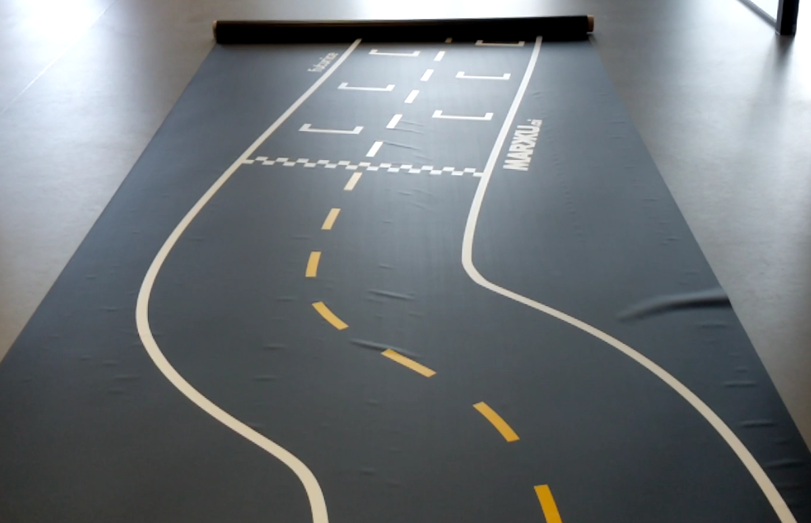

Markku.ai track design for autonomous vehicles
====

Track design is modular in a way that parts can be used in a few different configurations.

## Parts currently included:

* Starting grid part with corners
* Back part with corners
* Straight parts for use between the corner parts
* Intersection part for use between the corner parts

Cornered parts are available in both 8m and 12m long variants.

## Suggested configurations are:

* Short course: Grid + Back (**L:** 8m or 12m **W:** 4m)
* Long course: Grid + Back + 2 * Straight (**L:** 8m or 12m **W:** 4m - 9m)
* Intersections: Grid + Back + Intersection (**L:** 8m **W:** 6m)

## Printing instructions

Track is meant to be printed on 2m wide parts on black. Yellow should stay as is but **red is supposed to be printed as white**.

Our material has been PVC and Polyester tarpaulin.

---

This project is licensed under the terms of Creative Commons Attribution Share Alike 4.0.

## More information

We have covered our learnings about different kinds of tracks and the importance of a good track at our blog which can be found [here](https://markku.ai/post/track/).
